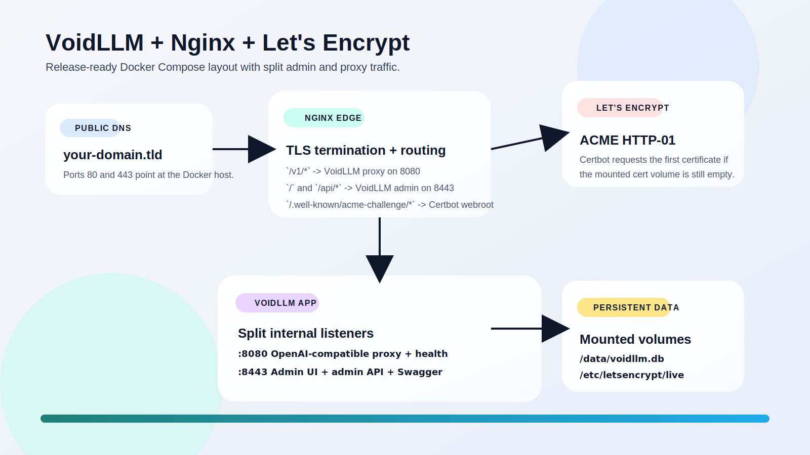
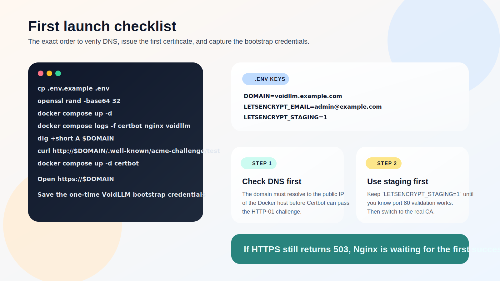

# VoidLLM Docker Compose

[](https://github.com/raistlinJ/voidllm-docker-compose/actions/workflows/validate-compose.yml)

This stack runs VoidLLM behind Nginx with automatic Let's Encrypt certificate issuance.

## What it does

- VoidLLM runs in split-port mode:
  - `8080` for `/v1` proxy traffic and health endpoints
  - `8443` for the admin UI and `/api/*`
- Nginx starts on port `80` immediately to serve ACME HTTP-01 challenges.
- If `./volumes/letsencrypt/live/$DOMAIN` does not contain a certificate yet, Certbot requests one from Let's Encrypt.
- As soon as the cert lands in the mounted volume, Nginx switches itself to the HTTPS config and starts redirecting `80 -> 443`.
- Certbot keeps running and renews certificates in place.

## Setup Screenshots





## Before you start

- Point the DNS `A` record for `DOMAIN` at the public IPv4 address of the Docker host.
- Add an `AAAA` record only if the host is reachable over public IPv6.
- Make sure inbound ports `80` and `443` are reachable from the public internet.
- If the host is behind a router, forward ports `80` and `443` to the Docker machine.
- If the host sits behind CGNAT or a private-only ISP connection, HTTP-01 validation from Let's Encrypt will not succeed without an external reverse tunnel or different ACME challenge method.
- Generate the required keys:

```bash
openssl rand -base64 32
```

Use the generated value for `VOIDLLM_ADMIN_KEY`.
`VOIDLLM_ENCRYPTION_KEY` can be set explicitly, or left blank in `.env` to auto-generate a persistent key on first startup.

## Quick Start

1. Copy `.env.example` to `.env` and fill in real values.
2. If you want HTTPS on a non-default host port, change `WEB_APP_PORT` in `.env`. Leave it at `443` for the normal `https://$DOMAIN` URL.
3. Leave `LETSENCRYPT_STAGING=1` for the first connectivity test to avoid burning real rate limits.
4. Start the stack:

```bash
docker compose up -d
```

5. Watch the bootstrap logs:

```bash
docker compose logs -f certbot nginx voidllm
```

6. Confirm that Nginx is answering the ACME path before switching to production issuance:

```bash
curl http://$DOMAIN/.well-known/acme-challenge/test
```

7. Once staging works, set `LETSENCRYPT_STAGING=0` in `.env` and restart Certbot:

```bash
docker compose up -d certbot
```

8. Open `https://$DOMAIN` after the real certificate is issued. If `WEB_APP_PORT` is not `443`, use `https://$DOMAIN:$WEB_APP_PORT` instead.

VoidLLM prints the bootstrap credentials once on first start. Save them from the `voidllm` logs.
If `VOIDLLM_ENCRYPTION_KEY` is blank, startup generates it and stores it in `./volumes/voidllm-data/voidllm-encryption.key`.

## Using Host Ollama From WebUI

If Ollama runs on the Docker host (not inside this Compose stack), configure it from the VoidLLM WebUI as an OpenAI-compatible provider.

1. Open the VoidLLM WebUI and go to the model/provider configuration page.
2. Add a provider using the OpenAI-compatible option (or OpenAI, depending on UI label).
3. Set `Base URL` to `http://host.docker.internal:11434/v1`.
4. If the UI requires an API key, use any non-empty placeholder value (for example `ollama`).
5. Set `Model` to an existing local Ollama model tag (for example `gemma4:31b` or `deepseek-r1:70b`).
6. Save and run a test prompt.

Notes:
- `host.docker.internal` lets containers reach services running on the host machine.
- For OpenAI-compatible mode, include `/v1` in the base URL.
- If your UI has a dedicated Ollama provider type, use host `host.docker.internal` and port `11434`, and follow that form's URL expectations.

## DNS Notes

- Use a hostname you control, not a bare IP address. Let's Encrypt does not issue certificates for raw IPs.
- Check propagation before the first run:

```bash
dig +short A $DOMAIN
dig +short AAAA $DOMAIN
```

- The returned address should match the public interface that accepts ports `80` and `443`.
- If you are replacing an old server at the same hostname, lower the DNS TTL before the cutover to reduce stale-cache delays.
- If you use Cloudflare or another proxying CDN, disable proxy mode until the first certificate is issued unless you have deliberately designed around that extra hop.

## Certificate Storage

- The stack only requests a brand-new certificate when the mounted files for `DOMAIN` do not exist yet.
- Once a certificate is present, Certbot switches to renewal mode and keeps using the existing certificate lineage.
- Certificates are stored on the host under `./certs` because that directory is bind-mounted to `/etc/letsencrypt` inside both the `nginx` and `certbot` containers.
- The active certificate files are:

```text
./certs/fullchain.pem
./certs/privkey.pem
```

- Certbot still keeps certificate lineage metadata in `./certs/live/$DOMAIN`, `./certs/archive`, and `./certs/renewal` for renewals.
- The ACME HTTP-01 webroot used during issuance is stored separately in `./volumes/certbot-www`.

## First-Run Troubleshooting

### Certbot never gets a certificate

- Check `docker compose logs certbot nginx`.
- Confirm the domain resolves to the correct host with `dig +short A $DOMAIN`.
- Verify port `80` is reachable from outside your network.
- Keep `LETSENCRYPT_STAGING=1` until challenge validation succeeds reliably.

### Nginx stays on HTTP and returns 503

- This is expected before the first successful certificate issuance.
- Check whether `./certs/fullchain.pem` and `./certs/privkey.pem` exist.
- If they do not exist, the failure is on the ACME side, not the Nginx side.

### VoidLLM is up but the site returns 502

- Check `docker compose logs voidllm nginx`.
- Confirm the VoidLLM container is healthy with `docker compose ps`.
- Validate the local config again with `docker compose config` after editing `.env` or `voidllm/voidllm.yaml`.

### Bootstrap credentials were missed

- They are printed once on the first VoidLLM start.
- If you no longer have them and the SQLite database has already been initialized, restoring them usually means resetting the persisted database in `./volumes/voidllm-data` and bootstrapping again.
- Do that only if losing the existing local data is acceptable.

## Continuous Validation

The repository includes a GitHub Actions workflow that runs on every push and pull request. It validates the Compose rendering with placeholder secrets and checks the shell entrypoint scripts for syntax regressions.
